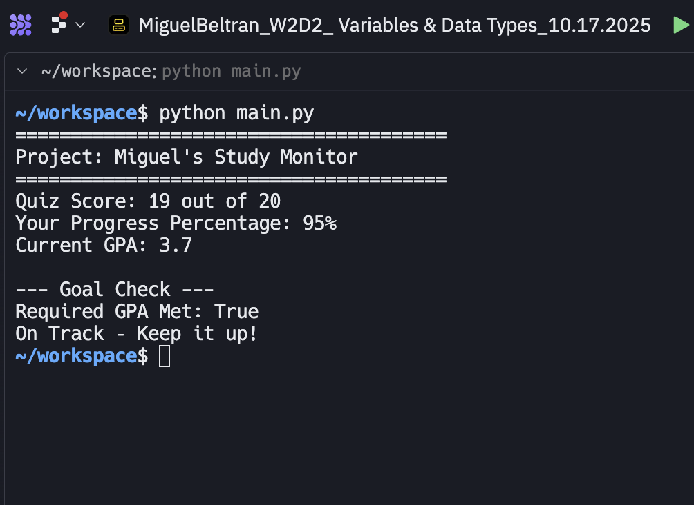
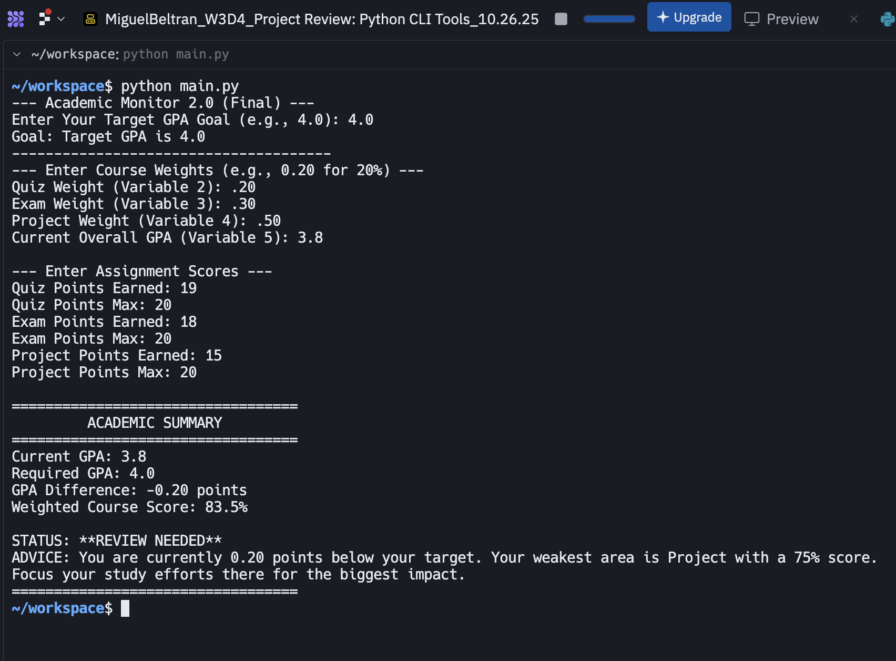
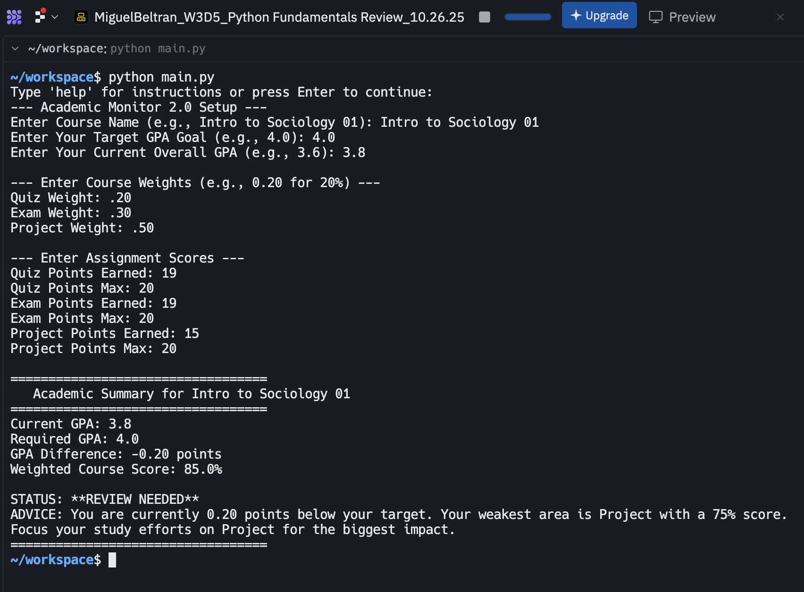

# 📚 Academic Monitoring System (Academic Monitor 2.0)

**This project models the evolutionary design process of a personal productivity tool using iterative development, feature expansion, and self-regulation to achieve specific human-defined academic goals.**

---

## 📈 Project Evolution & Design Iteration
This section highlights the product design lifecycle, tracking its evolution from a basic script to a sophisticated **behavioral feedback system** designed for personal **algorithmic governance.** 

---

## 🔹 Evolution Stages
- **1\_The\_Start\_W2D2.png:** Began as a **basic tracker** with static numbers, focused solely on initial **data capture**.
- **2\_The\_Upgrade\_W3D4.png:** Upgraded to analyze scores, introducing **goal-checking logic** and identifying the weakest subject area for targeted **intervention**.
- **3\_The\_Help\_Guide\_W3D5.png:** Integrated an **instant help menu** for user onboarding, ensuring the system's **accessibility and proper utilization**.
- **4\_The\_Data\_Collection\_Start\_W3D5.png:** Implemented a **smart planner setup** with safety checks, structuring the **data inputs that govern the algorithmic feedback**.

---

## 🔁 Iterative Refinement Flow
Information flows through three phases — **Basic Tracking → Goal Analysis → Smart Planning.**
This structured loop transformed a static utility into an adaptive academic planning system, reinforcing **accountability** and proactive subject management **through algorithmic nudges.**

---

## 🧩 Stage Analysis

*Shows the initial design and the transition to accepting new user input, establishing the foundation for **quantifying performance** and setting **self-regulatory** targets.*

**Core Features Added**
- **Goal Checking:** Compares current performance against **user-defined objectives**.
- **Weakest Subject Area Identification:** Calculates and flags the course most likely to pull down the overall GPA, directing **effort and attention**.
- **User Input Validation:** Added safety checks to ensure **data integrity**, which is crucial for accurate algorithmic analysis.

Each stage addressed the limitations of the previous, translating **human needs** into **system functionality**.

---

## 🧱 Key System Upgrades

*Focuses on the integration of the built-in help guide and the structured, safety-checked data collection process, modeling sound **system architecture**.*

**1. Onboarding Pattern – Instant Help Guide**
- Provides immediate, context-sensitive instructions, reducing the friction of new user adoption and ensuring consistent program use.
- Models an essential component for complex tools focused on **human-computer interaction**.

**2. Data Safety Pattern – Organized Input**
- Uses organized sections and safety checks to collect core planning data (Course Name, GPA, Weights).
- Ensures the planning algorithm runs on reliable inputs, building **user trust** in the system's output.

---

## 🔁 Before & After Comparison

*Visual comparison showing how dynamic data input and smart analysis improve the user’s ability to monitor and achieve academic goals.*

### Before
The system provided static feedback ("Keep it up!") without accepting new data, acting as a passive **data storage unit**.

### After
The redesigned system integrates dynamic score updates, weak-subject identification, and a structured planning setup, evolving into an **active monitoring system** maintaining continuous analysis toward **user-driven success**.

---

## 💻 Purpose
This project demonstrates how **iterative design and feature expansion** can be applied to a personal tool to enhance its utility, moving it from a passive tracker to an **active, goal-oriented monitoring system** that influences behavior and supports **self-governance**.

---

## 🧠 About This Project
This system was developed as the "Academic Monitor 2.0" to directly support a personal academic goal.
It integrates **data analysis with a user-friendly interface** to show how custom Python scripts can be designed to **self-regulate performance**, identify areas for improvement, and automate critical **monitoring tasks**.

---

Compares GPA to target and generates advice:
- **On Track:** Meeting or exceeding goal
- **Warning:** Near the threshold
- **Review Needed:** Below goal; requires focused effort. Highlights area for greatest impact.

---
### 🎨 Sample Output
```
Current GPA: 3.8 Required GPA: 4.0
STATUS: REVIEW NEEDED 
ADVICE: You are currently 0.20 points below your target
```
---
## 🔄 Future Directions

- **Strategic Course Planning:** I aim to analyze syllabi and course catalogs to recommend the optimal **course load and registration choices** for maximizing my academic success.
- **Personalized Time Guidance:** I plan to use predictive models to provide **targeted guidance** on distributing study time across specific subjects for the best grade outcome.
- **Visualize Future Trajectories:** I aim to integrate data visualization to model and display predicted future GPA scenarios, enabling proactive, data-driven decisions.
- **Address Algorithmic Fairness:** My aim is to critically examine the system’s logic to ensure all recommendations are **ethical and equitable**, and to analyze how digital systems influence student behavior.

---
## 🔎 Research Context

This project aligns with my ongoing research on **surveillance, algorithmic systems, and social control**.
By translating self-monitoring into code, *Academic Monitor 2.0* illustrates how **digital systems quantify performance, identify “weakness,” and shape user behavior** through structured feedback loops. It bridges **technical learning (Python logic)** and **sociological inquiry (algorithmic governance)** — showing how metrics, automation, and design can both **empower and discipline** individuals in pursuit of improvement.

---
## ▶️ Run Instructions
To run the program locally:
```bash
python main.py
